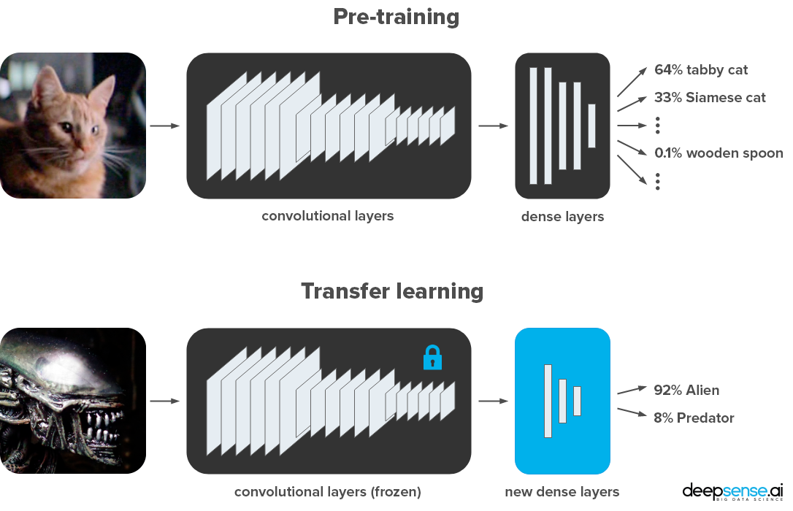
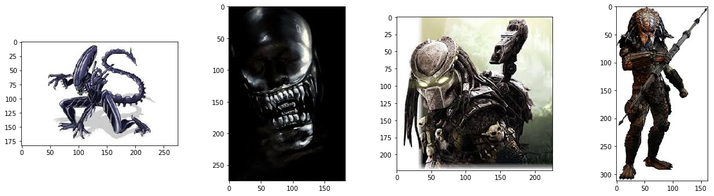

# Keras vs. PyTorch - Alien vs. Predator recognition with transfer learning

Featured in [deepsense.ai](https://deepsense.ai/) blog post [Keras vs. PyTorch - Alien vs. Predator recognition with transfer learning](https://deepsense.ai/keras-vs-pytorch-alien-vs-predator-recognition-with-transfer-learning), in which we discuss the differences. Code is in two Jupyter Notebooks:

* [Transfer learning with ResNet-50 in Keras](Keras-Resnet50.ipynb)
* [Transfer learning with ResNet-50 in PyTorch](PyTorch-Resnet50.ipynb)

See also the [upcoming webinar (10 Oct 2018)](https://www.crowdcast.io/e/KerasVersusPyTorch/register), in which we walk trough the code.

For plug&play interactive code, see the [Neptune versions with fancy charts](https://app.neptune.ml/deepsense-ai/Keras-vs-PyTorch) or these Kaggle Kernels:

* [Transfer learning with ResNet-50 in Keras - Kaggle Kernel](https://www.kaggle.com/pmigdal/transfer-learning-with-resnet-50-in-keras)
* [Transfer learning with ResNet-50 in PyTorch - Kaggle Kernel](https://www.kaggle.com/pmigdal/transfer-learning-with-resnet-50-in-pytorch)

# Data

See also: [Alien vs. Predator images | Kaggle](https://www.kaggle.com/pmigdal/alien-vs-predator-images).
In general, there are 447 images for each class, split into two classes. Examples:

# Requirements

If you want to run the code, see the requirements:

* Common:
  * jupyter==1.0.0
  * matplotlib==2.2.3
  * Pillow==5.2.0
  * h5py==2.8.0
* Keras:
  * tensorflow==1.10.1
  * Keras==2.2.2
* PyTorch:
  * torch==0.4.1
  * torchvision==0.2.1

